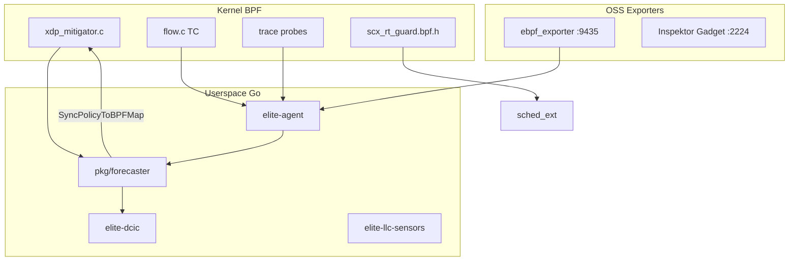

# eBPF Feature Inventory

Complete inventory of eBPF-related capabilities in this repository.

**Related:** [TEST_BENCHMARK_REGISTRY.md](TEST_BENCHMARK_REGISTRY.md) · [bpf/DEPRECATED_ORPHANS.md](../bpf/DEPRECATED_ORPHANS.md)

---

## Architecture

---

## 1. Kernel BPF programs (Elite product)

Active programs wired to `elite-agent` via bpf2go loaders in `pkg/exporter/probe/`.

| Feature | BPF source | Go loader | Description | Status |
|---------|------------|-----------|-------------|--------|
| XDP mitigator v3 | `bpf/xdp_mitigator.c` | via forecaster policy sync | Token-bucket admission, tier priority, DEVMAP redirect, ringbuf λ | active |
| Policy map ABI | `bpf/policy_map.h` | `pkg/forecaster/policy_bpf_sync.go` | 80-byte `elite_policy` / stats maps | active |
| socketlatency | `bpf/socketlatency.c` | `probe/tracesocketlatency/` | Socket read/write/send/recv latency | active |
| softirq | `bpf/softirq.c` | `probe/tracesoftirq/` | NET_RX softirq latency | active |
| packetloss | `bpf/packetloss.c` | `probe/tracepacketloss/` | `kfree_skb` drops with stack traces | active |
| tcpretrans | `bpf/tcpretrans.c` | `probe/tracetcpretrans/` | TCP retransmit tracepoint | active |
| connecttrace | `bpf/connect_trace.c` | `probe/traceconnect/` | `connect()` syscall latency | active |
| kernellatency | `bpf/kernellatency.c` | `probe/tracekernel/` | IP RX/TX kernel path latency | active |
| netiftxlat | `bpf/netiftxlatency.c` | `probe/tracenetiftxlatency/` | Netdevice queue/xmit latency | active |
| virtcmdlatency | `bpf/virtcmdlatency.c` | `probe/tracevirtcmdlat/` | VirtIO command latency | active |
| tcpreset | `bpf/tcpreset.c` | `probe/tracetcpreset/` | TCP reset events | active |
| biolatency | `bpf/tracebiolatency.c` | `probe/tracebiolatency/` | Block I/O latency events | active |
| flow (TC) | `bpf/flow.c` | `probe/flow/` | Per-flow packet/byte counters (LRU hash) | active |

### Shared BPF headers

| Path | Purpose |
|------|---------|
| `bpf/headers/inspector.h` | Tuple/SKB helpers, flow parsing |
| `bpf/headers/feature-switch.h` | Per-CPU probe feature toggles |
| `bpf/headers/common.h`, `vmlinux.h` | CO-RE BTF headers |

---

## 2. sched_ext contribution (upstream pack)

Separate from Elite product code. Submitted to [sched-ext/scx](https://github.com/sched-ext/scx) for issue #1202.

| Feature | Path | Description | Status |
|---------|------|-------------|--------|
| RT guard BPF header (L3) | `contrib/sched-ext/bpf/scx_rt_guard.bpf.h` | `sched_switch` interceptor; `scx_bpf_reenqueue_local()` | upstream PR pending |
| bpfland integration example | `contrib/sched-ext/bpf/scx_bpfland_rt_guard_example.bpf.c` | Include pattern for schedulers | reference |
| RT-aware watchdog (L2) | `contrib/sched-ext/kernel/0001-sched_ext-rt-aware-watchdog.patch` | Kernel stall detection patch | LKML ready |
| rt_guard_stress selftest | `contrib/sched-ext/selftests/rt_guard_stress.{c,bpf.c}` | kselftest scheduler + RT guard | active |
| Layer 1 (ext_server) | Andrea Righi `scx-dl-server` branch | DL server — track only, do not re-submit | external |

---

## 3. Deprecated / orphan BPF

No bpf2go loader in `pkg/exporter/probe/`. See [`bpf/DEPRECATED_ORPHANS.md`](../bpf/DEPRECATED_ORPHANS.md).

| File | Status | Notes |
|------|--------|-------|
| `bpf/tasklatency.c` | deprecated | Go package stub only |
| `bpf/nflatancy.c` | deprecated | No loader |
| `bpf/flowcount.c` | deprecated | No loader |
| `bpf/netns.c` | deprecated | No loader |
| `bpf/rxkernel.c`, `bpf/txkernel.c` | deprecated | Superseded by `kernellatency.c` |
| `bpf/kprobe.c` | deprecated | Demo only, not wired |

Gate D6 FH3 expects this inventory when orphans exist.

---

## 4. Userspace control plane

No new BPF beyond `xdp_mitigator` and trace probes.

| Feature | Path | Description | Status |
|---------|------|-------------|--------|
| Forecaster runner | `pkg/forecaster/runner.go` | Scrape → fuse → kinematic → policy sync | active |
| Kinematic engine | `pkg/forecaster/engine.go`, `kinematic.go` | EWMA + velocity/acceleration projection | active |
| Signal fusion | `pkg/forecaster/fuse.go` | Network + LLC + PSI fusion | active |
| Policy BPF sync | `pkg/forecaster/policy_bpf_sync.go` | Writes pinned `elite_policy` map | active |
| Kernel λ ringbuf | `pkg/forecaster/kernel_signal.go` | Drains XDP ringbuf signals | active |
| Shed controller | `pkg/forecaster/shed_controller.go` | PI control of `shed_ppm` | active |
| Traffic engine | `pkg/forecaster/traffic_engine.go` | Connection-rate kinematics | active |
| Decision bus | `pkg/forecaster/decision.go` | JSON handoff to DCIC/ECGF | active |
| Soft DCIC | `pkg/dcic/`, `cmd/elite-dcic/` | Cgroup/resctrl isolation `:9103` | active |
| LLC sensors | `pkg/llc/`, `cmd/elite-llc-sensors/` | PERF LLC miss-rate `:9104` | active |
| ECGF-lite | `pkg/ecgf/`, `cmd/elite-ecgf/` | Posture controller `:9105` | optional |
| Federation | `pkg/elitecontroller/`, `cmd/elite-controller/` | Multi-node policy push | optional |

---

## 5. Exporters and metrics

### Native Elite agent

| Component | Path | Endpoint | Description |
|-----------|------|----------|-------------|
| elite-agent | `cmd/exporter/main.go` | `:9102` | Main daemon: eBPF probes + forecaster metrics |
| btfhack | `cmd/btfhack/` | — | BTF discovery for CO-RE hosts |
| elite-updater | `cmd/elite-updater/` | — | Signed release updater |

### Host metrics probes (non-eBPF, agent-integrated)

| Probe | Path | Source |
|-------|------|--------|
| tcpsummary | `probe/proctcpsummary/` | `/proc` + sock_diag |
| shrinklat | `probe/procshrinklat/` | `/proc/vmstat` |
| netdev | `probe/procnetdev/` | `/proc/net/dev` |
| tcpext | `probe/procnetstat/` | `/proc/net/netstat` |
| softnet | `probe/procsoftnet/` | `/proc/net/softnet_stat` |
| snmp | `probe/procsnmp/` | `/proc/net/snmp*` |
| io, fd | `probe/procio/`, `procfd/` | `/proc/pid/*` |
| qdisc | `probe/nlqdisc/` | Netlink |
| conntrack | `probe/nlconntrack/` | Netlink |
| ipvs | `probe/procipvs/` | IPVS stats |
| rdma | `probe/rdma/` | sysfs/netlink |

### Physics pack (OSS compose)

| Component | Path | Endpoint | Description |
|-----------|------|----------|-------------|
| Physics pack installer | `scripts/oneclick/elite-physics-pack.sh` | — | Cloudflare ebpf_exporter + optional IG |
| ebpf_exporter unit | `scripts/oneclick/systemd/elite-ebpf-exporter.service` | `:9435` | Upstream CO-RE exporter |
| IG metrics | `scripts/oneclick/systemd/elite-ig-metrics.service` | `:2224` | Optional Inspektor Gadget |
| Version pins | `scripts/oneclick/versions.env` | — | Pinned release digests |
| Grafana dashboard | `scripts/oneclick/grafana-elite-physics-pack.json` | — | Pre-built dashboard |
| Metrics bridge | `scripts/oneclick/elite-metrics-bridge.py` | `:9102` | Soft-track metric merge |

Optional compose integrations (documented, off by default): `scripts/oneclick/compose/{ig,netstacklat,obi,parca,kepler,sec}.md`

---

## 6. Security

| Feature | Path | Description |
|---------|------|-------------|
| Loopback bind | `pkg/exporter/security/bind.go` | Rejects `0.0.0.0` unless `ELITE_ALLOW_PUBLIC_BIND=1` |
| Locked PATH exec | `pkg/exporter/security/execpath.go` | Hardened subprocess execution |
| Label sanitization | `pkg/exporter/security/labels.go` | Prometheus label validation |
| Agent capabilities | `deploy/contabo/elite-agent.service` | CAP_BPF, CAP_PERFMON, CAP_NET_ADMIN; CPU/memory quotas |
| PM2 guard | `deploy/contabo/pm2-guard.sh` | Protects co-resident apps during tests |

---

## 7. Deployment

| Target | Path | Description |
|--------|------|-------------|
| systemd (VPS) | `deploy/contabo/elite-agent.service`, `config.yaml` | Production unit + probe config |
| K8s DaemonSet | `deploy/elite-bundle.yaml` | Namespace, ConfigMap, DaemonSet |
| Helm | `deploy/helm/` | Chart with btfhack initContainer option |
| Vagrant lab | `deploy/vagrant-exporter/` | Multi-node exporter testing |
| One-click install | `scripts/oneclick/elite-oneclick.sh` | Profiled install (`predict`, `closed-loop`, `full`) |
| XDP attach | `scripts/contabo/xdp-attach.sh` | Load/unload `xdp_mitigator` |
| Rollback | `deploy/contabo/ROLLBACK.md` | Recovery procedures |

---

## 8. Verification harness

Mapped to [TEST_BENCHMARK_REGISTRY.md](TEST_BENCHMARK_REGISTRY.md).

| Domain | Scripts | Verdict |
|--------|---------|---------|
| D1 inventory | `benchmarks/ebpf-gates/global-ebpf-inventory.sh` | Artifact scan |
| D3 telemetry | `benchmarks/ebpf-gates/telemetry-probe-gate.sh` | `TELEMETRY_PROBE_GATE_PASS` |
| D4 X-Ray | `scripts/oneclick/ebpf-xray-real-proof.sh` | `REAL_EBPF_XRAY_PASS` |
| D6 future holes | `benchmarks/ebpf-gates/ebpf-future-holes.sh` | FH1–FH10 |
| SCX H1–H12 | `benchmarks/ebpf-gates/holy-grail-verify.sh` | `HOLY_GRAIL_1202_SOLVED=YES` |
| Global aggregate | `benchmarks/ebpf-gates/global-ebpf-aggregate.sh` | `GLOBAL_EBPF_PASS fail=0` |
| Static evidence | `scripts/verify-scx-1202-evidence.sh` | `SCX1202_EVIDENCE_VERIFY=PASS` |

---

## 9. Binaries summary

| Binary | Path | Role |
|--------|------|------|
| elite-agent | `cmd/exporter/` | eBPF telemetry + forecaster daemon |
| btfhack | `cmd/btfhack/` | BTF discovery |
| elite-dcic | `cmd/elite-dcic/` | Soft DCIC controller |
| elite-llc-sensors | `cmd/elite-llc-sensors/` | LLC PERF metrics |
| elite-ecgf | `cmd/elite-ecgf/` | ECGF posture |
| elite-controller | `cmd/elite-controller/` | Federation |
| elite-updater | `cmd/elite-updater/` | Release updater |
| skoop | `cmd/skoop/` | K8s network diagnosis (no eBPF) |

---

## 10. Counts

| Category | Count |
|----------|-------|
| Active wired eBPF probes | 11 trace + 1 TC flow + 1 XDP |
| sched_ext upstream artifacts | 1 header + 1 example + 1 selftest + 1 kernel patch |
| Deprecated BPF orphans | 7 |
| Userspace control-plane daemons | 5 (agent, dcic, llc, ecgf, controller) |
| Verification gate scripts | ~80 across `benchmarks/`, `scripts/oneclick/`, `scripts/contabo/` |
