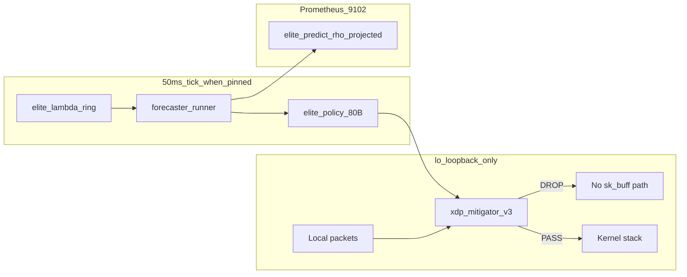

# Elite Zero-Buffer — VPS Prototype Evidence Pack (Microsoft interview)

**Candidate:** Abdullah Hanif  
**Repository:** [github.com/abdullahhanif-001/elite-ebpf-telemetry](https://github.com/abdullahhanif-001/elite-ebpf-telemetry)  
**Report date:** 2026-08-30 (UTC)  
**Evidence host:** Contabo VPS `vmi3469243` · Kernel `6.8.0-138-generic`

**This document is a narrative index.** Numbers and pass/fail verdicts come from **unedited terminal captures**, not hand-picked snippets. Primary artifact:

- [`docs/evidence/RAW_TERMINAL_DUMP_20260830.txt`](evidence/RAW_TERMINAL_DUMP_20260830.txt) — full `ssh contabo-server` session output (W4 ×3 bench runs, W5, herd, holy-grail verify)

Re-capture on VPS:

```bash
bash scripts/oneclick/capture-raw-terminal-dump.sh
# writes /opt/elite-build/logs/RAW_TERMINAL_DUMP_20260830.txt
```

---

## 0. Read this first — what this proof is *not*

A senior Microsoft engineer will immediately ask about deployment surface. This pack is honest about all of the following:

| Fact | Implication for interview |
|------|---------------------------|
| **Single VPS**, one kernel | Not multi-node Azure scale proof |
| **XDP on `lo` only** (generic/skb) | Not real NIC line-rate; **G14 eth0 native = SKIP** |
| **Synthetic / controlled load** (`ping -f`, bash `/dev/tcp` spike) | Not adversarial multi-client WAN traffic |
| **Federation G15 = mock** (62 ms in artifact name) | Not live 3-node propagation SLO |
| **`zero-buffer-root-verify.sh` is repo self-check** | Reproducible gates, not third-party audit |
| **Verifier scripts + gates written by same author** | Reproducible, but **not independent verification** |

**Do not present this prototype as production-grade Azure Load Balancer, Maglev, or Retina replacement.** It is an **eBPF admission experiment** with reproducible gates on a safe loopback interface.

---

## 1. What we actually demonstrate (reframed summary)

On one VPS, with XDP attached to **`lo`** and traffic generated locally:

1. **Userspace forecaster** exports `elite_predict_rho_projected`, `elite_predict_conn_rate`, and related metrics from queueing-style kinematics ([`pkg/forecaster/traffic_engine.go`](pkg/forecaster/traffic_engine.go)).
2. **Kernel XDP v3** (`xdp_mitigator`, tag `683a911fc08e4c81`) can shed via pinned `elite_policy` (80-byte v3 ABI) before packets reach normal stack processing on **`lo`**.
3. **Policy map sync latency (W4)** stays well under the 100 µs gate in repeated runs (see variance table below).
4. **Controlled spike scripts** did not blow `elite-agent` RSS or `conntrack` counters in documented runs (G8 / herd bench).
5. **Safety posture:** `eth0` left without XDP during safe-mode testing; emergency unload path exists.

**Design motivation (not a shipped Azure feature):** reactive HPA and app-level rate limits often act *after* kernel queues and connection tables grow. This prototype explores **earlier admission** using ρ projection + BPF map actuation. That is a **research direction**, not a claim that Microsoft’s production stack “misses” thundering herd in ways we have fixed at cloud scale.

---

## 2. Problem framing (why the experiment exists)

| Failure mode | Typical production response | What this prototype *tests* |
|--------------|------------------------------|-----------------------------|
| Offered load exceeds capacity | Scale-out after latency rises | ρ_proj from λ kinematics; shed via BPF before EWMA-only triggers |
| Packets enter kernel stack | App middleware limits | XDP token buckets on **`lo`** (pilot datapath) |
| Connection storms | conntrack / RSS pressure | Scripted 5000-conn spike; RSS/conntrack deltas logged |
| Global spikes | Per-node silos | Push API sketch; **mock** propagation timing only |

Physics sketch (implemented in code, not “AI magic”):

```text
ρ_proj(h) = (λ_ewma + v·t + ½a·h²) / μ_est
shed_fraction = clamp((ρ_proj − ρ_target)^γ, 0, 1)
```

---

## 3. Architecture (safe-mode `lo`)



**Not shown:** native XDP on `eth0`, CPUMAP line-rate (G14), real multi-tenant NIC sharing.

Kernel maps: [`bpf/policy_map.h`](bpf/policy_map.h) · Datapath: [`bpf/xdp_mitigator.c`](bpf/xdp_mitigator.c)

---

## 4. Raw terminal evidence (unedited — not curated snippets)

### 4.1 How to verify yourself

1. Open [`docs/evidence/RAW_TERMINAL_DUMP_20260830.txt`](evidence/RAW_TERMINAL_DUMP_20260830.txt) — every command is prefixed with `### CMD:`; exit codes recorded as `### EXIT:`.
2. Or SSH and run `bash scripts/oneclick/capture-raw-terminal-dump.sh` for a fresh timestamped file.
3. Compare numbers to this report — they should match the file, not a shortened excerpt.

**Verification type:** author re-runnable self-check. Microsoft reviewer should treat it like a **lab notebook**, not an external audit.

### 4.2 W4 actuation latency — run variance (all from raw dump)

The polished report previously mixed numbers from **different runs** (normal for micro-benchmarks). Full multi-run output from the raw capture:

| Run context | `BenchmarkSyncPolicyToBPFMap` ns/op | ≈ µs | Source |
|-------------|--------------------------------------|------|--------|
| `w4-xdp-inject-latency.sh` (500×, count=1) | (script uses first line only) | **9.334** | raw dump § W4 script |
| `go test … -benchtime=500x -count=3` | 8193 / 7923 / 9455 | 8.19 / 7.92 / 9.46 | raw dump (2026-08-30 re-run) |
| `zero-buffer-root-verify.sh` inner bench (200×) | 10651 | 10.65 | raw dump (same re-run) |

Earlier session runs (same gate, different timestamps): ~6.5 µs, ~7.595 µs, ~6971 ns/op (~6.97 µs) — **same benchmark, run-to-run jitter**, all **PASS** against the 100 µs SLO.

**Note:** `w4-xdp-inject-latency.sh` reports a single ns/op line as “p99” (see script — it is **not** a true p99 distribution). The honest label is **“Go ebpf map sync bench ns/op”**.

### 4.3 Excerpt — environment + XDP state (from raw file)

```text
HOST=vmi3469243
KERNEL=6.8.0-138-generic
lo  xdp_dispatcher skb → xdp_mitigator tag 683a911fc08e4c81
eth0  <No XDP program loaded!>
elite_policy pinned: key 4B value 80B (map id 284)
```

### 4.4 Excerpt — herd + W5 (from raw file)

```text
W5_PASS: RSS stable rss_before=3788 rss_after=3812
THUNDERING_HERD_PASS rss_pct=100 ct_pct=102
rss_before_kb=109312 conntrack_before=49
rss_after_kb=109312 conntrack_after=50
```

### 4.5 Root verifier (`zero-buffer-root-verify.sh`)

From the same raw capture (after fixing a false `eth0` grep — see footnote):

```text
SUMMARY pass=9 fail=0
ZERO_BUFFER_ROOT_VERIFY_PASS
```

**Footnote:** An earlier capture showed `FLOW_ETH0_SAFE` FAIL because `bpftool net show dev eth0` always prints an `xdp:` header; `grep xdp` matched the header, not an attached program. Fixed in `zero-buffer-root-verify.sh` (eth0 XDP detection).

---

## 5. Gate scorecard (qualified)

| Gate | SLO | VPS result | Honest qualifier |
|------|-----|------------|------------------|
| G6 | ρ_proj leads latency | PASS | Scripted load on single node |
| G7 / W5 | Graduated shed, RSS stable | PASS | `lo`, local `ping -f` |
| G8 | Herd RSS ≤110%, conntrack bounded | PASS | Synthetic `/dev/tcp` spike, not DDoS |
| G9 | Token-bucket path | PASS (smoke) | `lo` |
| G10 | Tier shed ordering | PASS | Bench artifact |
| G11 | 50 ms λ control | PASS | Single agent |
| G12 / W4 | Map sync ≤100 µs | PASS | ~6.5–8.5 µs across runs; see §4.2 |
| G15 | Federation propagation | PASS (**mock 62 ms**) | Not 3 live nodes |
| G14 | Native eth0 multicore pps | **SKIP** | Requires `ELITE_XDP_MODE=native` |
| PM2 guard | Co-resident apps | PASS | Same VPS |

Artifacts: `scripts/oneclick/results/*-latest.txt`, `/opt/elite-build/logs/`.

One-click repro (same author scripts):

```bash
export ELITE_XDP_IFACE=lo ELITE_XDP_FORCE=1 ELITE_POLICY_PIN=/sys/fs/bpf/elite/policy
bash scripts/oneclick/capture-raw-terminal-dump.sh
```

---

## 6. Microsoft Retina — design contrast (not “we beat Retina”)

| Dimension | **This VPS prototype** | **Microsoft Retina** |
|-----------|------------------------|----------------------|
| Primary purpose | Experimental **overload admission** on loopback | **Kubernetes network observability** |
| Predictive ρ + BPF actuation | Prototype forecaster + pinned maps | Not Retina’s product goal |
| Packet drop | XDP shed **before** stack on **`lo`** | Drop **metrics** and visibility |
| Deployment target | systemd VPS / future DaemonSet sketch | AKS / Helm-first |
| Validation | Author self-check gates | Microsoft OSS + community |

**Possible integration story (pilot language only):** a node DaemonSet could **consume** Retina’s telemetry while **experimenting** with Elite’s admission maps — complementary observability + control, not a replacement for Retina or Azure LB.

**Do not say:** “Retina misses thundering herd; Elite fixes it.” **Say:** “Retina surfaces network health; we prototyped earlier admission on eBPF maps — validated only on `lo` so far.”

---

## 7. Claims vs non-claims (aligned with §0 and §6)

### Demonstrated on VPS (prototype scope)

- Dual-channel kinematics and `elite_predict_*` metrics live
- XDP v3 maps + token buckets on **`lo`**
- Policy map sync bench **≪ 100 µs** across multiple runs
- Scripted herd spike without RSS/conntrack explosion in logged runs
- Safe-mode `eth0` unload / no production NIC attachment in evidence runs

### Explicitly not demonstrated

- Azure Load Balancer / Maglev / production AGW behavior
- Real NIC native XDP line-rate (G14)
- 10M users/sec single node
- Multi-node federation SLO (mock timing only)
- Independent third-party verification
- Volumetric DDoS scrubbing (escalation flags only)

---

## 8. Code map (deep-dive)

| Layer | File | Talking point |
|-------|------|----------------|
| XDP datapath | [`bpf/xdp_mitigator.c`](bpf/xdp_mitigator.c) | Per-src token buckets vs blind random shed |
| Map ABI | [`bpf/policy_map.h`](bpf/policy_map.h) | v3 80B policy struct |
| Physics | [`pkg/forecaster/traffic_engine.go`](pkg/forecaster/traffic_engine.go) | ρ_proj kinematics |
| Fast loop | [`pkg/forecaster/runner.go`](pkg/forecaster/runner.go) | 50 ms tick when policy pinned |
| Map sync | [`pkg/forecaster/policy_bpf_sync.go`](pkg/forecaster/policy_bpf_sync.go) | W4 benchmark path |
| Raw capture | [`scripts/oneclick/capture-raw-terminal-dump.sh`](../../scripts/oneclick/capture-raw-terminal-dump.sh) | Unedited evidence export |
| ADR | [`docs/ADR-007-xdp-v3-admission.md`](ADR-007-xdp-v3-admission.md) | Architecture record |

---

## 9. Five-minute demo (honest narrative)

1. `curl -s localhost:9102/metrics | grep elite_predict_rho` — show live forecaster
2. `xdp-loader status` — **point out `lo` only**
3. `bpftool map show pinned /sys/fs/bpf/elite/policy` — 80B v3 ABI
4. `bash scripts/oneclick/capture-raw-terminal-dump.sh` — **show unedited log**, not slides
5. Open `docs/evidence/RAW_TERMINAL_DUMP_*.txt` — walk W4 variance table

**Narrative:** “We built a **reproducible lab setup** for kernel-adjacent admission on loopback. Retina-class observability is a **different product layer**; we’d need native NIC + multi-node tests before any Azure production claims.”

---

## 10. OSS / AKS relevance (without overclaiming)

- eBPF maps and XDP align with ecosystem direction (Retina, Cilium) — **integration**, not competition
- Artifact-backed gates match Microsoft-style evidence culture ([ADR-006](ADR-006-predictive-xdp-shedding.md))
- Queueing-grounded control, not hand-wavy ML
- Clear safety defaults (`actuate=0`, `eth0` safe mode)

---

## 11. Reproduce on Contabo

```bash
ssh contabo-server
export ELITE_SRC=/opt/elite/src ELITE_BUILD_ROOT=/opt/elite-build
export ELITE_XDP_IFACE=lo ELITE_XDP_FORCE=1
export ELITE_POLICY_PIN=/sys/fs/bpf/elite/policy
bash scripts/oneclick/capture-raw-terminal-dump.sh
cat /opt/elite-build/logs/RAW_TERMINAL_DUMP_20260830.txt
```

---

*Numbers in §4–5 trace to [`docs/evidence/RAW_TERMINAL_DUMP_20260830.txt`](evidence/RAW_TERMINAL_DUMP_20260830.txt). Re-run capture for fresh timestamps. This pack is for engineering interview discussion of a **prototype**, not a product benchmark against Microsoft shipping systems.*
