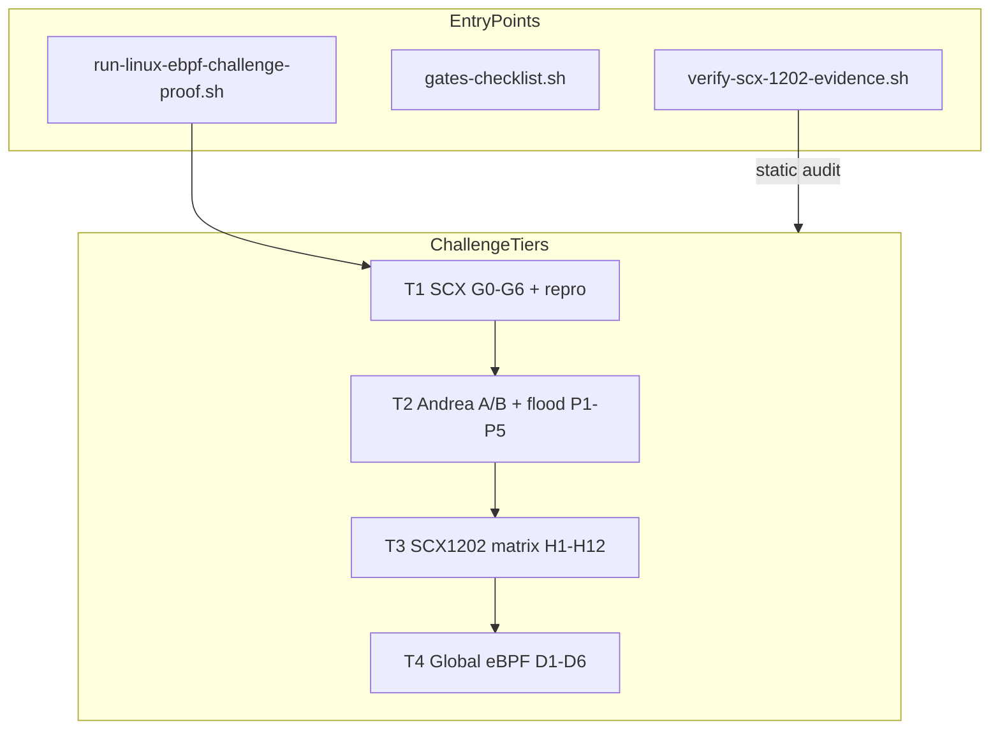

# Test and Benchmark Registry

Engineering reference for all verification gates, orchestrators, and evidence bundles in this repository.

**Related:** [EBPF_FEATURE_INVENTORY.md](EBPF_FEATURE_INVENTORY.md) · [evidence/scx-1202/README.md](evidence/scx-1202/README.md)

---

## 1. How to read this document

| Convention | Meaning |
|------------|---------|
| **Verdict token** | Machine-readable line printed by a script (e.g. `RT_GUARD_PASS fail=0`). Scripts exit non-zero on failure unless noted. |
| **REAL_ONLY=1** | Required on proof hosts. Disables mocks and synthetic inject paths in sched_ext and eBPF gates. |
| **Evidence path** | Committed bundle under `docs/evidence/scx-1202/` or local `scripts/oneclick/results/` (gitignored raw trees). |
| **sched_ext proof host** | Linux kernel with `CONFIG_SCHED_CLASS_EXT=y` (e.g. 6.19-rc7 + ftrace). Generic 6.8 kernels cannot run SCX gates. |

---

## 2. Master orchestrators

| Script | Purpose | Output |
|--------|---------|--------|
| [`scripts/contabo/run-linux-ebpf-challenge-proof.sh`](../scripts/contabo/run-linux-ebpf-challenge-proof.sh) | Full T1–T4 challenge (SCX + global eBPF) | `docs/evidence/scx-1202/CHALLENGE_PROOF_<date>/` |
| [`scripts/contabo/run-scx-1202-evidence.sh`](../scripts/contabo/run-scx-1202-evidence.sh) | Legacy single-bundle SCX capture | `docs/evidence/scx-1202/VERIFICATION_<timestamp>/` |
| [`scripts/contabo/run-challenge-finish-lite.sh`](../scripts/contabo/run-challenge-finish-lite.sh) | Finish partial run (P5 lite + tier 3/4) | Same `CHALLENGE_PROOF_*` tree |
| [`scripts/verify-scx-1202-evidence.sh`](../scripts/verify-scx-1202-evidence.sh) | Static auditor (no VPS) | Exit 0 = `SCX1202_EVIDENCE_VERIFY=PASS` |
| [`scripts/oneclick/gates-checklist.sh`](../scripts/oneclick/gates-checklist.sh) | Production gates G0–G15 from live scrapes | `results/gates-checklist-latest.txt` |
| [`scripts/oneclick/elite-zero-buffer-complete.sh`](../scripts/oneclick/elite-zero-buffer-complete.sh) | Zero-buffer proof chain | Multiple artifact files under `results/` |
| [`scripts/oneclick/elite-run-safe.sh`](../scripts/oneclick/elite-run-safe.sh) | PM2-safe VPS suite (S*, H11, gates) | `results/` artifacts |
| [`benchmarks/run-overhead.sh`](../benchmarks/run-overhead.sh) | Agent CPU overhead SLO | stdout `PASS: elite_agent_cpu_*` |



---

## 3. Challenge proof tiers (SCX#1202)

| Tier | Scripts | Verdict token | Evidence |
|------|---------|---------------|----------|
| **T1** | `rt-guard-pass.sh`, `rt-monopolization-repro.sh` | `RT_GUARD_PASS fail=0`, `STALL_DETECTED=NO` | `tier1/01-RT_GUARD_PASS.verdict`, `tier1/02-repro.verdict` |
| **T2** | `prove-scx1202-arighi.sh`, `rt-guard-flood-phase.sh`, aggregate | `ANDREA_PROOF_PASS fail=0`, `RT_GUARD_FLOOD_PASS fail=0` | `tier2/ANDREA_PROOF.verdict`, `tier2/04-FLOOD.verdict` |
| **T3** | `holy-grail-verify.sh` | `HOLY_GRAIL_1202_SOLVED=YES checks=12/12` | `tier3/02-HOLY_GRAIL.verdict` |
| **T4** | `global-ebpf-aggregate.sh` | `GLOBAL_EBPF_PASS fail=0` | `tier4/03-GLOBAL.verdict` |
| **Overall** | orchestrator | `LINUX_EBPF_CHALLENGE_PASS fail=0` | `CHALLENGE_VERDICT.txt` |

---

## 4. sched_ext gates (G0–G6)

Scripts under [`benchmarks/sched-ext-gates/`](../benchmarks/sched-ext-gates/).

| ID | Script | Purpose | Pass criterion |
|----|--------|---------|----------------|
| **G0** | `vps-connect-check.sh` | SSH + `sched_ext=YES` | Connection and kernel config |
| **G1** | `rt-guard-pass.sh` (G1) | kselftest `rt_stall` | EXT ≥4% under RT |
| **G2** | `rt-guard-pass.sh` (G2) | kselftest `rt_guard_stress` | 60s soak, no stall exit |
| **G3** | `rt-guard-pass.sh` (G3) | `rt_guard_stress` extended | Same as G2 |
| **G4** | `rt-monopolization-repro.sh` | Issue #1202 reproduction | `STALL_DETECTED=NO` when fixed |
| **G5** | `rt-guard-pass.sh` (G5) | A/B control | Pre-fix vs fixed comparison |
| **G6** | `rt-guard-pass.sh` (G6) | 5min bpfland soak | `SOAK_PASS` (direct `scx_bpfland`) |

**Flood phases (D2 / P1–P5):**

| ID | Script | Purpose | Pass criterion |
|----|--------|---------|----------------|
| **P1** | `rt-guard-flood-phase.sh 1` | kselftests under load | Phase checkpoint PASS |
| **P2** | `rt-guard-flood-phase.sh 2` | Negative control | `NEGATIVE_CONTROL_PASS` |
| **P3** | `rt-guard-flood-phase.sh 3` | Scheduler matrix | `PASS_LOADER` entries |
| **P4** | `rt-guard-flood-phase.sh 4` | Edge matrix E1–E7 | Edge verdicts |
| **P5** | `rt-guard-flood-phase.sh 5` | Endurance / ftrace soak | Phase PASS (lite mode skips per-scheduler ftrace on small VPS) |
| **Aggregate** | `rt-guard-flood-aggregate.sh` | Merge P1–P5 | `RT_GUARD_FLOOD_PASS fail=0` |

**Andrea A/B proof (T2):**

| Arm | Condition | Expected |
|-----|-----------|----------|
| C | bpfland + ext_server, no L3 | `rt_stall` EXT ≥4% (L1 necessary) |
| A | bpfland without `scx_rt_guard` | Stall / failure documented |
| B | bpfland with `scx_rt_guard` | `rt_guard_stress` PASS, no false stall |

Script: [`prove-scx1202-arighi.sh`](../benchmarks/sched-ext-gates/prove-scx1202-arighi.sh)

---

## 5. SCX#1202 verification matrix (H1–H12)

Script: [`benchmarks/ebpf-gates/holy-grail-verify.sh`](../benchmarks/ebpf-gates/holy-grail-verify.sh)

| ID | Check | Pass criterion |
|----|-------|----------------|
| H1 | `rt_stall` | EXT task ≥4% runtime |
| H2 | `rt_guard_stress` | 60s soak message present |
| H3 | Edge E1 | Per-CPU RT + loader |
| H4 | Edge E3 | Multi-CPU RT |
| H5 | #1202 repro | `STALL_DETECTED=NO` with loader |
| H6 | Edge E5 | lavd 35s (or documented SKIP in lite mode) |
| H7 | Endurance | 5min soak (lite) or 30min (full) |
| H8 | Edge E2 | SCHED_DEADLINE (SKIP documented in lite) |
| H9 | Edge E4 | Partial mode / kselftest proxy |
| H10 | Negative control | `NEGATIVE_CONTROL_PASS` |
| H11 | Minimal scheduler | Healthy scheduler negative test |
| H12 | Scheduler matrix | 5/6 `PASS_LOADER` + lavd documented SKIP |

---

## 6. Global eBPF domains (D1–D6)

Scripts under [`benchmarks/ebpf-gates/`](../benchmarks/ebpf-gates/).

| ID | Script | Purpose | Pass criterion |
|----|--------|---------|----------------|
| **D1** | `global-ebpf-inventory.sh` | Scan BPF surfaces | `inventory.json` + audit |
| **D2** | flood aggregate (sched_ext) | sched_ext stress evidence | `RT_GUARD_FLOOD_PASS` |
| **D3** | `telemetry-probe-gate.sh` | Wired probes compile + metrics | `TELEMETRY_PROBE_GATE_PASS` |
| **D4** | `ebpf-xray-real-proof.sh` (oneclick) | Live BPF inventory X1–X8 | `REAL_EBPF_XRAY_PASS` |
| **D5** | Go tests | `pkg/exporter`, `pkg/forecaster` | `go test` PASS |
| **D6** | `ebpf-future-holes.sh` | FH1–FH10 regression gates | All FH checks PASS |
| **Aggregate** | `global-ebpf-aggregate.sh` | Merge D1–D6 | `GLOBAL_EBPF_PASS fail=0` |

**X-Ray sub-checks (D4):** X1 inventory · X2 compile · X3 metrics · X4 policy ABI · X5 XDP attach · X6 map parity · X7 PM2 guard · X8 REAL_ONLY

---

## 7. Production gates (G0–G15)

Script: [`scripts/oneclick/gates-checklist.sh`](../scripts/oneclick/gates-checklist.sh)

| ID | Scope | Pass criterion |
|----|-------|----------------|
| G0 | Baseline artifacts | `G0_BASELINE_ARTIFACTS_OK` |
| G1 | Forecaster metrics | `elite_predict_*` on `:9102` |
| G1b | Agent metrics | `elite_*` series present |
| G2 | Soft DCIC | `elite_dcic_*` on `:9103` |
| G3 | Category bakeoff | Artifact dir under `results/` |
| G4 | PM2 guard | `PM2_GUARD_OK` |
| G5 | Live predict | `p1-live-*` artifact tree |
| G6 | Traffic engine | `LAMBDA_LEADS_PASS` |
| G7 | XDP graduated shed | `W5_PASS` |
| G8 | Thundering herd | `THUNDERING_HERD_PASS` |
| G9 | Token bucket | `G9_TOKEN_BUCKET_PPS_PASS` or SKIP |
| G10 | Priority tiers | `G10_PRIORITY_PASS` |
| G11 | 50ms lambda leads | `LAMBDA_LEADS_50MS` (strict with `ZERO_BUFFER_GATES=1`) |
| G12 | W4 actuation latency | W4 inject pass |
| G13 | Thundering herd eth0/lo | `THUNDERING_HERD_PASS` bench |
| G14 | Multicore | `G14_MULTICORE_PASS` or SKIP |
| G15 | Federation | `G15_FEDERATE_PROPAGATION_PASS` |

Set `ZERO_BUFFER_GATES=1` for strict G6–G8, G11, G13.

---

## 8. Competitive and overhead gates

| ID | Script | Pass criterion |
|----|--------|----------------|
| **S0–S5** | `competitive-speed-proof.sh` | Written to `COMPETITIVE_SPEED.md` |
| **H0–H11** | `heavy-engineer-suite.sh` | `HEAVY_PASS` or pending Sonar |
| **H11** | `competitive-live-predict-proof.sh` | Live predict inject PASS |
| **W4** | `benchmarks/contabo-gates/w4-xdp-inject-latency.sh` | p99 ≤100µs policy update |
| **W5** | `benchmarks/contabo-gates/w5-xdp-graduated-shed.sh` | `W5_PASS` RSS stable under load |

**Agent SLO** ([`benchmarks/README.md`](../benchmarks/README.md)):

| Metric | Target | Script |
|--------|--------|--------|
| CPU overhead | <1% core (60s) | `run-overhead.sh` |
| RSS (systemd) | <160 MB | `run-overhead.sh --mode systemd` |
| PM2 restart delta | 0 | `run-loadtest.sh` + pm2-guard |

---

## 9. Maintainer Q&A

This section maps reviewer questions to reproduction commands and committed evidence paths.

### Quick verdict

```bash
cat docs/evidence/scx-1202/CHALLENGE_PROOF_*/CHALLENGE_VERDICT.txt
# LINUX_EBPF_CHALLENGE_PASS fail=0
```

### Q&A matrix

| Audience | Question | Command | Expected | Evidence |
|----------|----------|---------|----------|----------|
| Maintainer | Is ext_server + SCX_ENQ_REIMED sufficient? | `prove-scx1202-arighi.sh` | Arm C PASS, Arm B PASS | `tier2/ANDREA_PROOF_REPORT.md` |
| Maintainer | Why `scx_rt_guard` on sched_switch? | Read L3 header | `scx_bpf_reenqueue_local()` | `contrib/sched-ext/bpf/scx_rt_guard.bpf.h` |
| Maintainer | Does `rt_stall` pass? | kselftest `./runner rt_stall` | EXT ≥4% | `tier1/01-rt-guard-pass.log` |
| Auditor | Is sched_ext enabled? | `grep CONFIG_SCHED_CLASS_EXT /boot/config-$(uname -r)` | `=y` | `00-preflight.txt` |
| Auditor | Valid proof host? | `hostname` + kernel | sched_ext host, 6.19-rc7 | `00-preflight.txt` |
| Auditor | Full eBPF stack verified? | `global-ebpf-aggregate.sh` | `GLOBAL_EBPF_PASS fail=0` | `tier4/03-GLOBAL.verdict` |
| Auditor | H1–H12 matrix? | `holy-grail-verify.sh` | `checks=12/12` | `tier3/02-HOLY_GRAIL.verdict` |
| Skeptic | False positive stall? | P2 negative control | broken BPF still fails | `tier2/flood-P2.log` |
| Skeptic | REAL_ONLY enforced? | `ebpf-future-holes.sh` | FH10 PASS | `tier4/D6-future-holes.log` |
| Product | Telemetry probes? | `telemetry-probe-gate.sh` | `TELEMETRY_PROBE_GATE_PASS` | `tier4/D3-telemetry.log` |
| Product | eBPF X-Ray live? | `ebpf-xray-real-proof.sh` | `REAL_EBPF_XRAY_PASS` | `tier4/D4-xray.log` |
| #1202 | Stall still occurs? | `rt-monopolization-repro.sh` | `STALL_DETECTED=NO` | `tier1/02-repro.verdict` |
| Flood | P1–P5 all pass? | `rt-guard-flood-aggregate.sh` | `RT_GUARD_FLOOD_PASS fail=0` | `tier2/04-FLOOD.verdict` |

### Why ext_server alone is insufficient

Layer 1 (ext_server) gives EXT tasks CPU time — `rt_stall` shows EXT ≥4% under RT load (Arm C). When RT monopolizes the CPU and the BPF scheduler lacks `scx_rt_guard`, the `sched_switch` path does not re-enqueue runnable EXT tasks. That gap is the core of #1202. Layer 3 (`scx_rt_guard`) closes it (Arm B).

### Why generic VPS kernels fail SCX gates

Kernels without `CONFIG_SCHED_CLASS_EXT` (e.g. stock 6.8 on some cloud images) cannot load sched_ext schedulers. SCX gates are valid only on a sched_ext proof host.

### Maintainer reply template (#1202)

> We agree ext_server + SCX_ENQ_REIMED is necessary — `rt_stall` shows EXT ≥4% under RT load (Arm C).
>
> It is not sufficient alone: stock bpfland lacks `scx_rt_guard`; the sched_switch reenqueue path is separate from deadline-server enqueue. Our `rt_guard_stress` selftest and 60s soak pass with L3 (Arm B).
>
> Evidence: `docs/evidence/scx-1202/CHALLENGE_PROOF_<date>/` — reproducible via `run-linux-ebpf-challenge-proof.sh`.

---

## 10. Evidence bundle index

| Bundle | Path | Verifier |
|--------|------|----------|
| Challenge proof (full) | `docs/evidence/scx-1202/CHALLENGE_PROOF_20260901/` | `verify-scx-1202-evidence.sh` |
| Legacy verification | `docs/evidence/scx-1202/VERIFICATION_20260901-045612/` | same |
| Auditor entry | `docs/evidence/scx-1202/README.md` | — |

**Required verdict files (challenge bundle):**

| File | Required content |
|------|------------------|
| `CHALLENGE_VERDICT.txt` | `LINUX_EBPF_CHALLENGE_PASS fail=0` |
| `tier1/01-RT_GUARD_PASS.verdict` | `RT_GUARD_PASS fail=0` |
| `tier2/ANDREA_PROOF.verdict` | `ANDREA_PROOF_PASS fail=0` |
| `tier2/04-FLOOD.verdict` | `RT_GUARD_FLOOD_PASS fail=0` |
| `tier3/02-HOLY_GRAIL.verdict` | `HOLY_GRAIL_1202_SOLVED=YES checks=12/12` |
| `tier4/03-GLOBAL.verdict` | `fail=0` / `GLOBAL result=PASS` |

**Claim policy:** Say *verified fix + challenge proof pass*. Do not claim upstream closure until sched-ext/scx#1202 is merged and the issue is closed.

---

## 11. Reproduction commands

```bash
# Full challenge (sched_ext proof host, lite flood for 4 vCPU / 8 GB)
export REAL_ONLY=1 ELITE_SRC=/opt/elite/src FLOOD_LITE_MODE=1
bash scripts/contabo/run-linux-ebpf-challenge-proof.sh

# Finish partial run
bash scripts/contabo/run-challenge-finish-lite.sh

# Single tier
bash scripts/contabo/run-linux-ebpf-challenge-proof.sh 2

# VPS prep (first time on proof host)
bash scripts/contabo/sched-ext-vps-prep.sh scx-build
bash scripts/contabo/sched-ext-vps-prep.sh scx-loader
bash scripts/contabo/sched-ext-vps-prep.sh apply-patches
bash scripts/contabo/sched-ext-vps-prep.sh kselftest-build
bash scripts/contabo/sched-ext-vps-prep.sh verify

# Static verify (any machine)
bash scripts/verify-scx-1202-evidence.sh

# Production gates
bash scripts/oneclick/gates-checklist.sh
```

Deploy to proof host:

```bash
scp -r update-ebpf/* #####:/opt/elite/src/
ssh ##### 'bash /opt/elite/src/scripts/contabo/run-linux-ebpf-challenge-proof.sh'
```

---

## 12. Optional extended challenge (Tier 3b)

| Phase | Script | Notes |
|-------|--------|-------|
| P4b | `rt-guard-edge-matrix.sh` E1–E7 | Full edge matrix |
| P6/P7 | `rt-guard-endurance.sh` | 30min per scheduler |
| Boot | `boot-ftrace-kernel.sh` | Separate ftrace kernel session |

Baseline `LINUX_EBPF_CHALLENGE_PASS` does not require Tier 3b.
